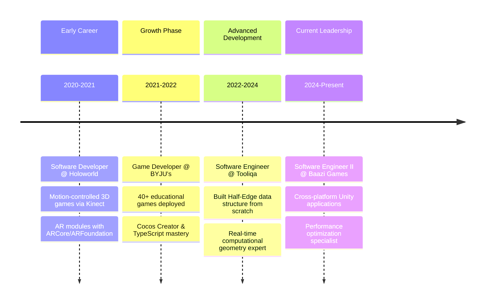

# 🚀 Aman Kumar Yadav | Software Engineer & Graphics Programming Enthusiast

<div align="center">
  
[](https://amanyadev.github.io/)
[](https://www.linkedin.com/in/amankumaryadav/)
[](mailto:yadav.aman099@gmail.com)

**Software Engineer II (Unity) @ Baazi Games | Delhi, India**  
*Specializing in Real-time Graphics, Game Development & System Architecture*

</div>

---

## 🌟 Professional Summary

Tech-agnostic developer with **4+ years** of experience across multiple domains, from **low-level graphics programming** to **enterprise-scale applications**. Expert in **Unity3D, C#, React Native**, and **real-time computational geometry**. Currently leading cross-platform game development at Baazi Games while maintaining a strong focus on performance optimization and system architecture.

## 🎯 Core Expertise

```cpp
class AmansSkills {
    Languages:     ["C#", "C++", "TypeScript", "Java", "HLSL", "GLSL"]
    Engines:       ["Unity3D", "Unreal Engine", "Cocos Creator"] 
    Graphics:      ["Vulkan API", "OpenGL", "DirectX", "Shader Programming"]
    Platforms:     ["Desktop", "Mobile", "WebGL", "AR/VR"]
    Architecture:  ["IoC/DI", "MVC", "SOLID", "Data-Oriented Design"]
};
```

## 🔥 Featured Projects & Repositories

### 🎮 [cg_vulkan](https://github.com/amanyadev/cg_vulkan) - Low-Level Graphics Engine
> **Advanced Vulkan API Implementation in C++**
- **92.8% C++** | **5.7% GLSL** | **MIT License**
- Clean architectural design with modular Vulkan API wrapper
- Features: Device management, pipeline setup, command buffer optimization
- Demonstrates deep understanding of **modern graphics programming**

**Tech Stack:** `Vulkan SDK` `GLFW3` `CMake 3.20+` `C++17`

### ⚡ [IOC-Unity](https://github.com/amanyadev/IOC-Unity) - Dependency Injection Framework
> **Lightweight IoC Container for Unity & C# Applications**
- **100% C#** | **Cross-platform compatibility**
- Advanced software architecture with fallback dependency support
- Used in production for **improved code maintainability** and **modular design**

**Features:** `Dependency Injection` `Modular Architecture` `Unity Integration`

### 🔺 [HalfEdge](https://github.com/amanyadev/HalfEdge) - Computational Geometry Library
> **Custom DCEL Data Structure Implementation**
- **100% C#** | Built from scratch for **Twinn Create** (Architecture App)
- Efficient mesh representation for **real-time 3D manipulation**
- Enables complex **topological operations** and **procedural geometry**
- Production-grade implementation used in commercial software

**Applications:** `Mesh Processing` `3D Modeling` `Architectural Visualization`

## 💼 Current Role & Impact

**Software Engineer II @ Baazi Games** *(Apr 2024 - Present)*
- Leading development of **cross-platform mobile app** using React Native + Unity
- Shipped **desktop application** with C#, Unity & Electron for 100K+ users
- Optimized **multi-window operations** for seamless low-end system performance
- Developed **custom C++ plugins** for enhanced functionality
- **Performance tuning** using Unity Profiler & RenderDoc (eliminated draw call overhead)

## 🏆 Key Achievements & Recognition

- **🎯 Unity Technologies Ex-Student Ambassador** - Official trainer conducting workshops
- **🏅 Hackware - Schneider Electric Finalist** - Innovative tech solutions competition  
- **📊 40+ Educational Games Deployed** - At BYJU's with millions of user interactions
- **📖 Published Research** - "Open Source Flight Simulator" in IJIRSET

## 📈 Technical Journey & Experience Timeline



## 🛠️ Notable Technical Contributions

### Production Systems Architecture
- **Twinn Create App**: End-to-end architectural solution with custom Half-Edge implementation
- **Pokerbaazi Desktop**: Multi-window gaming platform serving 100K+ users
- **Educational Gaming Suite**: 40+ games with automated CI/CD to AWS S3

### Open Source Innovation
- **Vulkan Graphics Engine**: Modern C++17 implementation with clean architecture
- **IoC Framework**: Production-ready dependency injection for Unity ecosystem
- **Flight Simulator**: Published research on open-source aviation simulation

## 🌐 Professional Networks & Community

<div align="center">

[](https://amanyadev.github.io/)
[](https://www.linkedin.com/in/amankumaryadav/)
[](mailto:yadav.aman099@gmail.com)
[](https://github.com/amanyadev)

</div>

---

<div align="center">

**🎯 "Solving challenging problems across multiple domains with precision and innovation"**

*Currently open to exciting opportunities in Graphics Programming, Game Development & System Architecture*

⭐ **Star repositories you find interesting** | 🔄 **Fork for collaboration** | 💬 **Reach out for discussions**

</div>
